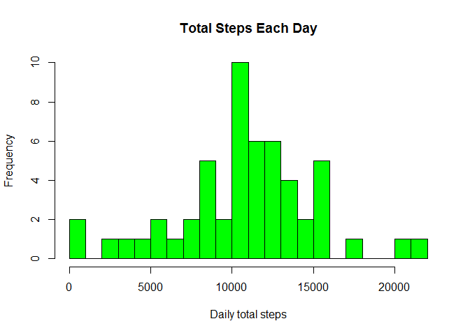
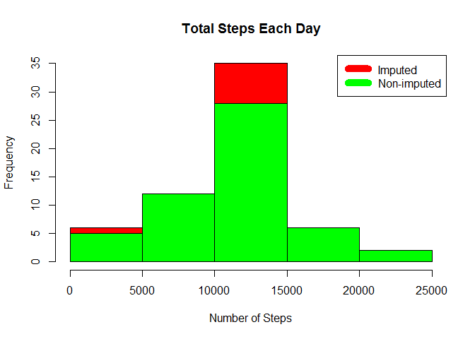
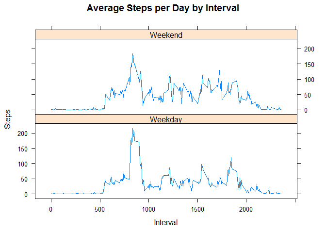

# Reproducible Research: Peer Assessment 1
David Sola Roman  
March, 2015  

## Loading and preprocessing the data
Unzip and load data into data frame `data`. You need the zip file in your working directory

```r
unzip("activity.zip")
data <- read.csv("activity.csv")
```


## What is mean total number of steps taken per day?
Sum steps by day, create Histogram, and calculate mean and median.

```r
steps_by_day <- aggregate(steps ~ date, data, sum)
rmean <- mean(steps_by_day$steps)
rmedian <- median(steps_by_day$steps)
rsd <- sd(steps_by_day$steps)
hist(steps_by_day$steps, main = paste("Total Steps Each Day"), col="green",breaks=30,xlab="Daily total steps",ylab="Frequency",)
```

 

The `mean` is 10766.19 the `median` is 10765 and the `standard deviation` is 4269.18 .


## What is the average daily activity pattern?
* Calculate average steps for each interval for all days. 
* Plot the Average Number Steps per Day by Interval. 
* Find interval with most average steps. 


```r
steps_by_interval <- aggregate(steps ~ interval, data, mean)
plot(steps_by_interval$interval,steps_by_interval$steps, type="l", xlab="Interval", ylab="Number of Steps",main="Average Number of Steps per Day by Interval")
```

 

```r
max_interval <- steps_by_interval[which.max(steps_by_interval$steps),1]
max_interval_value <- steps_by_interval[steps_by_interval$interval == max_interval,]$steps
```

The 5-minute interval, on average across all the days in the data set, containing the maximum number of steps is 835 which value is  206.1698113.


## Imputing missing values
Missing data needed to be imputed. Only a simple imputation approach was required for this assignment. 
Missing values were imputed by inserting the average for each interval. Thus, if interval 10 was missing on 10-02-2012, the average for that interval for all days (0.1320755), replaced the NA. 

```r
incomplete <- sum(!complete.cases(data))
imputed_data <- transform(data, steps = ifelse(is.na(data$steps), steps_by_interval$steps[match(data$interval, steps_by_interval$interval)], data$steps))
```

Zeroes were imputed for 10-01-2012 because it was the first day and would have been over 9,000 steps higher than the following day, which had only 126 steps. 
NAs then were assumed to be zeros to fit the rising trend of the data. 

```r
imputed_data[as.character(imputed_data$date) == "2012-10-01", 1] <- 0
```
Recount total steps by day and create Histogram. 


```r
steps_by_day_i <- aggregate(steps ~ date, imputed_data, sum)
hist(steps_by_day_i$steps, main = paste("Total Steps Each Day"), col="red", xlab="Number of Steps")
#Create Histogram to show difference. 
hist(steps_by_day$steps, main = paste("Total Steps Each Day"), col="green", xlab="Number of Steps", add=T)
legend("topright", c("Imputed", "Non-imputed"), col=c("red", "green"), lwd=10)
```

 

Calculate new mean and median for imputed data. 

```r
rmean.i <- mean(steps_by_day_i$steps)
rmedian.i <- median(steps_by_day_i$steps)
```

Calculate difference between imputed and non-imputed data.

```r
mean_diff <- rmean.i - rmean
med_diff <- rmedian.i - rmedian
```
Calculate total difference.

```r
total_diff <- sum(steps_by_day_i$steps) - sum(steps_by_day$steps)
```
* The imputed data mean is 10589.69 
* The imputed data median is 10766.19 
* The difference between the non-imputed mean and imputed mean is -176.4948964
* The difference between the non-imputed mean and imputed mean is 1.1886792
* The difference between total number of steps between imputed and non-imputed data is 75363.32. Thus, there were 75363.32 more steps in the imputed data.


## Are there differences in activity patterns between weekdays and weekends?
Created a plot to compare and contrast number of steps between the week and weekend. There is a higher peak earlier on weekdays, and more overall activity on weekends.  

```r
weekdays <- c("Monday", "Tuesday", "Wednesday", "Thursday", "Friday") #If your language is English
weekdays <- c("lunes", "martes", "miércoles", "jueves", "viernes") #If your language is Spanish
imputed_data$dow = as.factor(ifelse(is.element(weekdays(as.Date(imputed_data$date)),weekdays), "Weekday", "Weekend"))
steps_by_interval_i <- aggregate(steps ~ interval + dow, imputed_data, mean)
library(lattice)
xyplot(steps_by_interval_i$steps ~ steps_by_interval_i$interval|steps_by_interval_i$dow, main="Average Steps per Day by Interval",xlab="Interval", ylab="Steps",layout=c(1,2), type="l")
```

 
